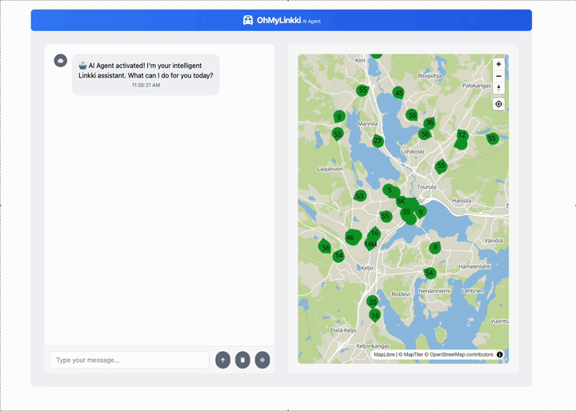

# 🚌 OhMyLinkki

An Azure AI-powered assistant for tracking Linkki bus lines in Jyväskylä, Finland. The application provides real-time bus locations and an AI chat interface for public transportation queries.

This is a technology demo project showcasing [Azure AI](https://azure.microsoft.com/en-us/solutions/ai), [Microsoft Agent Framework](https://learn.microsoft.com/en-us/agent-framework/overview/agent-framework-overview), and [Model Context Protocol (MCP)](https://modelcontextprotocol.io/docs/getting-started/intro).

## 🎬 Demo



## ✨ Features

- Real-time bus tracking using GTFS Realtime data
- Interactive map showing bus locations
- AI chat assistant for transportation queries
- WebSocket-based live updates

## 📁 Project Structure

- `src/api/` - .NET 9 backend service
- `src/ui/` - React + TypeScript frontend

## 🛠️ Development Setup

### Prerequisites

- Visual Studio Code
- Dev Containers extension for VS Code
- Docker Desktop

### 🚀 Getting Started

1. Clone the repository and open it in VS Code
2. When prompted, click "Reopen in Container" or use Command Palette (F1) and select "Dev Containers: Reopen in Container"
3. VS Code will build and start the development container with all required dependencies

### ⚙️ Configuration

#### Get Waltti API Credentials

To get the `WalttiUsername` and `WalttiPassword`, you need to register at <https://digitransit.fi/en/developers/api-registration/>. Please follow the instructions on that page.

#### Create Configuration Files

Create `src/api/appsettings.Development.json` with the following structure:

```json
{
  "LinkkiImport": {
    "WalttiUsername": "your_username",
    "WalttiPassword": "your_password",
    "ImportInterval": 3000
  },
  "OpenAi": {
    "Endpoint": "your_openai_endpoint"
  },
  "CosmosDb": {
    "ConnectionString": "your_cosmos_connection_string"
  },
  "WebPubSub":{
    "Endpoint": "your_pubsub_endpoint"
  }
}
```

Create `src/ui/.env` with the following structure to overwrite API_URL.

```properties

# Development in devcontainer (default)
API_URL="http://localhost:5074"

# Development with IDE on host
# API_URL="http://host.docker.internal:5074"
```

### ▶️ Running the Application

1. Start the MCP server and API :

```sh
cd src/McpServer
dotnet run

cd src/api
dotnet run
```

2. Start the frontend:

```sh
cd src/ui
bun run dev --host
```

The application will be available at:

- Frontend: <http://localhost:5173>
- Backend: <http://localhost:5074>

## ☁️ Deploy to Azure

Follow these steps to deploy the solution to Azure.

### 🐳 Build Images

Use following commands to create and push images to Azure Container Registry.

Set username and versions.

```sh
export AZURE_CONTAINER_REGISTRY_URL=<acr_login_url>
export OHMYLINKKI_API_VERSION=<version>
export OHMYLINKKI_UI_VERSION=<version>
export OHMYLINKKI_MCP_SERVER_VERSION=<version>
export OHMYLINKKI_NGINX_PROXY_VERSION=<version>

```

Tag and push images to Azure Container Registry.

```sh

az acr login --name $AZURE_CONTAINER_REGISTRY_URL

docker build -t $AZURE_CONTAINER_REGISTRY_URL/ohmylinkki/api:$OHMYLINKKI_API_VERSION -f src/api/Dockerfile .
docker push $AZURE_CONTAINER_REGISTRY_URL/ohmylinkki/api:$OHMYLINKKI_API_VERSION

docker build -t $AZURE_CONTAINER_REGISTRY_URL/ohmylinkki/ui:$OHMYLINKKI_UI_VERSION -f src/ui/Dockerfile src/ui/
docker push $AZURE_CONTAINER_REGISTRY_URL/ohmylinkki/ui:$OHMYLINKKI_UI_VERSION

docker build -t $AZURE_CONTAINER_REGISTRY_URL/ohmylinkki/nginx-proxy:$OHMYLINKKI_NGINX_PROXY_VERSION -f nginx-proxy/Dockerfile nginx-proxy
docker push $AZURE_CONTAINER_REGISTRY_URL/ohmylinkki/nginx-proxy:$OHMYLINKKI_NGINX_PROXY_VERSION

docker build -t $AZURE_CONTAINER_REGISTRY_URL/ohmylinkki/mcp-server:$OHMYLINKKI_MCP_SERVER_VERSION -f src/McpServer/Dockerfile .
docker push $AZURE_CONTAINER_REGISTRY_URL/ohmylinkki/mcp-server:$OHMYLINKKI_MCP_SERVER_VERSION


```

### 🚀 Deploy Azure Infra

Follow these steps to deploy solutions to Azure:

1. Open terminal
2. Log in using your Microsoft Entra ID credentials: `az login --use-device-code`
3. Go to the directory: `cd infra/bicep/stacks/ohmylinkki`
4. First verify the changes using what-if command:

    ```shell
    az deployment sub what-if --subscription {subscription} --location {location} --template-file main.bicep --parameters {env}.bicepparam
    ```

5. Deploy the stack:

    ```shell
    az stack sub create --name ohmylinkki --subscription {subscription} --location {location} --deny-settings-mode none --action-on-unmanage detachAll --template-file main.bicep --parameters {env}.bicepparam
    ```

## 📄 License

This project is licensed under the MIT License.
